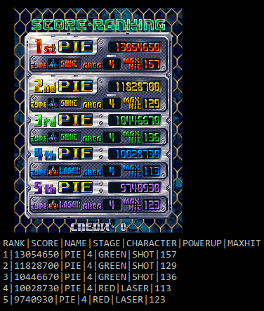

# hi2txt-xml - mame hiscores reading
mame hiscores files descriptions, to produce user or computer friendly output

## Introduction
Mame emulator is saving games hiscores, thanks to the "hiscore" embedded plugin (maintained by **borgar**) and the hiscore.dat file, describing what memory part to dump into .hi or nvram files (maintained by **Leezer**).

This XML files are 'just' describing how to convert .hi or nvram files into XML or TEXT files. 

These are the game specific files, written in XML, following the syntax described [here](http://greatstone.free.fr/hi2txt/doc/xml.html).
Each file has:
* a descriptive structure to specify how to extract binaries information from the hiscores binary file saved by mame software.
* a descriptive output, showing how to display these information 

They are necessary to operate the hiscores extraction [engine](http://greatstone.free.fr/hi2txt) itself (written in Java, along with a C# port).

The goal is mainly to allow third-party software to parse hiscores of mame players, either for internal display, proposing a leaderboard system, along with achievements.
Scoring is the heart of the Arcade World!   

This repository is separated from the engine repository, because they do not have the same life-cycle.
The hard and long work is to write XML description for each of the 10000 mame games: there are regularly new XMLs to support existing or new games. You do not need to be a software engineer to contribute by proposing a new XML file.
On the other side, the engine is now stable enough to allow the description of the new games, without new features to be introduced frequently, ans requires a different skills set.  

## Technologies
* XML
* DTD
* Gradle 6+
* IntelliJ IDEA
* GitHub :)

## Setup
A release is composed of:
* hi2txt.zip file, containing all individual game specific XML files
* hi2txt_default.zip file, containing all individual game specific default hiscores extracted in XML
* hi2txt_xml.version

They need to be put as-is in the folder containing the hi2txt engine, downloadable [here](http://greatstone.free.fr/hi2txt/).
They can overwrite the existing files, as they will be surely more recent than the ones included with the engine itself.
 
 ## Contribution
 Every contribution is welcome. Please, join the project and propose new XML, fixed XML or submit issues.
 
 Reported issues must be related to hi2txt and games XML only:
 if the .hi or nvram files are not created, or corrupted, such issues should be reported to the maintainer of the hiscore.dat file (**Leezer**), enabling mame to save such hiscores files. 
 
 After filtering mame games to keep the working / non-mechanical / non-casino / ... games, nearly 30% are currently supported, letting a lot of job on the table :)  
 
 ## Contributors
 Some people helped by providing xml for new games:
 * Thomas B.
 * Samuli T.
 * Jason P.
 * Piergiorgio G.
 * William L.
 
 ## Inspiration
 This initiative took its roots from the defunct [hitotext](https://sourceforge.net/projects/hitotext/) software (alternate [repo](https://github.com/Fyrecrypts/HiToText)).
 It was no more actively maintained, as well as requiring hard-coding some game specific processing into the engine itself.
 Thanks, **Fyrecrypts**!
 
 ##
 Follow the project on twitter: https://twitter.com/hi2txt
 
 
 